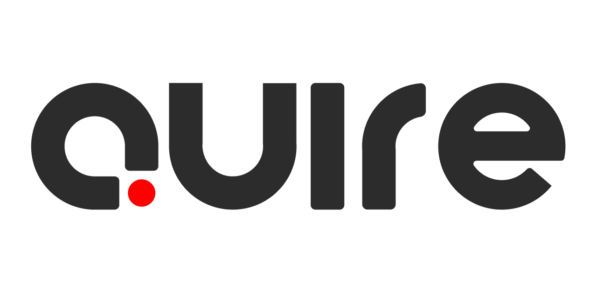

<p align="center">
  
</p>

<p align="center">
  <strong>A calm, local-first workspace for writing and compiling LaTeX.</strong>
</p>

<p align="center">
  Write in a focused editor, compile with the TeX installation already on your machine, and read the resulting PDF without sending your work anywhere.
</p>

<p align="center">
  <a href="#why-quire">Why Quire</a> ·
  <a href="#quick-start">Quick start</a> ·
  <a href="#how-it-works">How it works</a> ·
  <a href="#contributing">Contributing</a> ·
  <a href="SECURITY.md">Security</a>
</p>

## Why Quire

Writing tools should feel dependable, private, and pleasantly quiet. Quire is an open-source, local-first workspace for LaTeX projects that runs on your own computer.

Your project files remain ordinary files in a local workspace. Compiles use your installed TeX distribution. The PDF preview is generated and displayed locally. There is no account to create, no remote compile queue, and no cloud quota between you and your document.

| Quire gives you | What that means |
| --- | --- |
| Local projects | Your source files stay in a folder you control. |
| Local compilation | `latexmk` runs with your local TeX Live or MacTeX installation. |
| A focused workspace | Editor, project tree, build controls, diagnostics, and PDF preview belong in one place. |
| Plain-file portability | Open an existing project, work normally, and take it with you whenever you like. |
| Open source | Inspect the implementation, adapt it to your workflow, and help make it better. |

## Features

- **A considered writing surface** — CodeMirror-powered source editing, sensible shortcuts, tabs, quick open, and a project tree that stays out of the way.
- **Real local builds** — Compile with `pdflatex`, `xelatex`, or `lualatex` through `latexmk`.
- **Auto compile that behaves naturally** — When enabled, edits and newly selected text source files compile after the configured pause; the latest successful PDF refreshes in place.
- **Useful diagnostics** — File and line-aware compiler errors are surfaced beside the document rather than buried in a terminal.
- **A dedicated PDF reader** — Continuous pages, zoom, fit width, page controls, download, and safe handling of rapid rebuilds.
- **Project-friendly imports** — Start from a blank template or bring in an existing ZIP archive without changing its structure.
- **Light and dark appearances** — A warm, restrained interface with a persistent appearance preference.
- **Optional AI Assistant** — Bring your own OpenAI API key for deliberate, selected-text writing help; each suggestion remains yours to review before it changes the document.
- **A responsive product site** — Learn about Quire on any screen size, then open the local workspace when you are ready to write.

## Quick start

### Prerequisites

Install the following before running Quire:

1. **Node.js 20 or newer**
2. **A TeX distribution** with `latexmk` and at least one engine:
   - macOS: MacTeX or BasicTeX
   - Linux: TeX Live
   - Windows: MiKTeX or TeX Live

> Quire needs `latexmk` for compilation. The app can use pdfLaTeX, XeLaTeX, or LuaLaTeX depending on the project setting.

### Install and run

```bash
git clone https://github.com/aliiexe/Quire.git
cd Quire
npm ci
npm run doctor
npm run dev
```

Open [http://localhost:3000](http://localhost:3000), then choose **Open Quire** to create or import a project.

If the doctor reports that TeX is missing, install or repair your TeX distribution and run it again:

```bash
npm run doctor
```

### Production build

```bash
npm run build
npm start
```

## macOS app and DMG builds

Quire is packaged for macOS with Electron. The installed app opens directly into the local workspace, keeps projects in `~/Documents/Quire` by default, and runs the bundled Quire server only on `127.0.0.1`.

### Run the desktop app during development

```bash
npm run desktop:dev
```

This starts the Next.js development server, waits until it is ready, and opens Quire in its native macOS window.

### Build installers

```bash
npm run desktop:build
```

The command creates two DMG installers in `release/`:

| Installer | Macs |
| --- | --- |
| `Quire-<version>-arm64.dmg` | Apple Silicon: M1, M2, M3, M4, and later |
| `Quire-<version>-x64.dmg` | Intel Macs |

Upload both files to a GitHub Release so the **Download for macOS** actions on the landing page lead users to the available installers.

### Publish a free macOS preview

Quire can be released as a free, unsigned preview before Apple Developer ID signing is available. Create a GitHub Release, attach the DMG files, and use the prepared [release description](docs/GITHUB_RELEASE_TEMPLATE.md). It explains that users may need to choose **System Settings → Privacy & Security → Open Anyway** after their first launch attempt.

### For a future Apple-verified release

Local DMG builds are suitable for testing, but signed and notarized releases give users a smoother first launch. Until Quire has a valid Apple Developer ID, Gatekeeper will show an unidentified-developer warning to people who download the preview.

Set up a Developer ID Application certificate and Apple notarization credentials in your release environment before publishing a public release. Electron Builder detects valid signing credentials and applies them during the packaging step.

### Deploy the website with Vercel

Import this repository into Vercel as a Next.js project. The public privacy-policy route is included automatically at `/privacy`.

In **Vercel → Settings → Environment Variables**, set `NEXT_PUBLIC_QUIRE_WEBSITE_URL` to `https://quire-app.vercel.app` (or your custom domain). Redeploy after changing it. The macOS app then opens that URL in the user&apos;s default browser, and the App Store privacy-policy URL will be:

```text
https://quire-app.vercel.app/privacy
```

## Everyday workflow

1. Create a blank article or report, or import an existing ZIP project.
2. Choose the root `.tex` file and compiler in project settings.
3. Write in the editor and save normally.
4. Leave **Auto compile** on for a fresh preview after each pause, or use **Recompile** when you want an explicit build.
5. Read, zoom, or download the latest PDF directly beside the source.

### Keyboard shortcuts

| Action | Shortcut |
| --- | --- |
| Quick open | `Cmd/Ctrl + P` |
| Save current file | `Cmd/Ctrl + S` |
| Force a compile | `Cmd/Ctrl + Enter` |

## Configuration

Quire works without configuration. By default, projects live in the repository's `workspace/` directory and builds are written into each project's `.quire/build/` directory.

Use a local environment file when you want to move the workspace or change the build timeout:

```bash
# .env.local
QUIRE_WORKSPACE=/absolute/path/to/your/quire-workspace
QUIRE_COMPILE_TIMEOUT_MS=60000
```

| Variable | Default | Purpose |
| --- | --- | --- |
| `QUIRE_WORKSPACE` | `<repository>/workspace` | The folder containing all local Quire projects. |
| `QUIRE_COMPILE_TIMEOUT_MS` | `60000` | Maximum duration of one LaTeX build, in milliseconds. |

Each project stores its own settings, including root file, selected engine, auto-compile preference, delay, and SyncTeX setting, in `.quire/project.json`.

## How it works

```text
Your project files
       ↓
Quire editor and project tree
       ↓
latexmk + your local TeX distribution
       ↓
.quire/build/<document>.pdf
       ↓
Built-in PDF preview
```

Quire is built with Next.js and React, with CodeMirror for source editing and PDF.js for previewing. A small project-storage layer keeps filesystem operations scoped to the configured workspace. The compiler starts `latexmk` as a local process with explicit arguments rather than through a shell command.

The project is intentionally designed around normal LaTeX folders. Quire does not require a proprietary file format, a database, or an online account to edit and compile a document.

## Privacy and local-first design

Quire's core workflow runs on your machine:

- Project source, assets, and generated PDFs stay in your configured workspace.
- The local web server is for your own browser session; it is not a hosted editor.
- The TeX compiler is the one installed on your computer.
- There is no built-in authentication, telemetry pipeline, or cloud-sync requirement.

The optional AI Assistant is disabled until you add your own OpenAI API key. When you explicitly ask it to help, Quire sends only the passage you selected and the requested editing action to OpenAI under your own account; it never automatically uploads a project. The key is stored with macOS Keychain. Read the complete policy at [quire-app.vercel.app/privacy](https://quire-app.vercel.app/privacy).

As with any local development server, only run Quire on networks and machines you trust. See [SECURITY.md](SECURITY.md) for the current threat model and compiler safeguards.

## Project structure

```text
src/
  app/                 Next.js pages and local API routes
  components/          Workspace and marketing UI
  lib/compiler/        latexmk integration and diagnostics parsing
  lib/projects/        Local storage and safe path handling
  stores/              Client-side workspace state
public/                Brand assets, fonts, and marketing imagery
workspace/             Default location for local projects
scripts/doctor.ts      Local environment diagnostic
```

## Development

| Command | Description |
| --- | --- |
| `npm run dev` | Start the development server with Webpack. |
| `npm run build` | Produce an optimized production build. |
| `npm start` | Run the production build. |
| `npm run doctor` | Check Node, `latexmk`, and installed TeX engines. |
| `npx tsc --noEmit` | Type-check the application. |

Before opening a pull request, please run:

```bash
npx tsc --noEmit
npm run build
```

## Contributing

Contributions are welcome, whether they improve a small interaction or help shape the product's future.

1. Fork the repository and create a focused branch.
2. Keep changes local-first: avoid introducing a cloud dependency unless it is clearly optional and documented.
3. Preserve the plain-file project model and respect the current security boundaries around filesystem access and compilation.
4. Test the affected flow with a real LaTeX project where possible.
5. Open a pull request that explains the problem, the approach, and how you verified it.

For security-sensitive issues, please do not open a public issue. Follow the reporting guidance in [SECURITY.md](SECURITY.md).

## License

Quire is free and open source under the [MIT License](LICENSE). You may use, copy, modify, distribute, and sell copies of the software under the license terms.

The published app policy lives at the website&apos;s `/privacy` page. Until the website is deployed, the source for that page is available in [`src/app/privacy/page.tsx`](src/app/privacy/page.tsx).

## Roadmap

Quire is focused first on making the local writing experience exceptional. Areas that may benefit from community discussion include templates, more editor ergonomics, better project discovery, and optional collaboration workflows that never compromise the local core.

## Acknowledgements

Quire is built with [Next.js](https://nextjs.org/), [React](https://react.dev/), [CodeMirror](https://codemirror.net/), [PDF.js](https://mozilla.github.io/pdf.js/), and the TeX ecosystem.

---

Made for people who want their writing tools to feel like their own.
